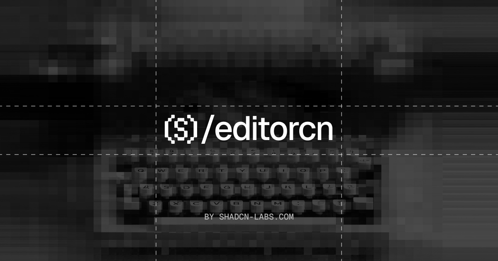

  

<h1 align="center">editorcn</h1>

  Rich text editor components for <a href="https://ui.shadcn.com/">shadcn/ui</a> projects. Built on <a href="https://tiptap.dev/">Tiptap</a>. 
  Zero config. One command setup. Install via <a href="https://ui.shadcn.com/docs/registry">shadcn registry</a> or npm.

  <a href="https://editorcn.vercel.app/docs">Get Started</a> ·
  <a href="https://editorcn.vercel.app/docs/getting-started">Installation</a> ·
  <a href="https://editorcn.vercel.app/docs/editor">Editor</a> ·
  <a href="https://editorcn.vercel.app/docs/block-editor">Block Editor</a>

## Features

- **Theme-aware** — Automatically adapts to your shadcn/ui theme tokens
- **Zero config** — Works out of the box with sensible defaults
- **shadcn/ui compatible** — Uses the same registry format and CLI
- **Tiptap powered** — Full access to the Tiptap editor ecosystem
- **Composable** — Build complex editors with declarative, composable components
- **20+ toolbar controls** — Bold, italic, headings, lists, links, alignment, embeds, and more
- **Slash commands** — Notion-style slash command menu with drag handles and bubble menu
- **Customizable** — Override icons, labels, colors, and controls via props

## Community

The editorcn community lives on [GitHub](https://github.com/shadcn-labs/editorcn), where you can ask questions, share ideas, and show what you've built.

## Contributing

Contributions are welcome. See [CONTRIBUTING.md](CONTRIBUTING.md) to get the repo running locally and land a change, and use [issues](https://github.com/shadcn-labs/editorcn/issues) and [discussions](https://github.com/shadcn-labs/editorcn/discussions) to collaborate. By participating, you agree to the [Code of Conduct](./CODE_OF_CONDUCT.md).

## Security

Please do not open public issues for security vulnerabilities. Follow [SECURITY.md](./SECURITY.md) and report them privately through GitHub Security Advisories.

## License

[MIT](LICENSE)

## Contributors

> Made with [contrib.rocks](https://contrib.rocks)

## Star History

<a href="https://www.star-history.com/?repos=AbdullahMukadam%2FEditorcn&type=date&legend=top-left">
 <picture>
   <source media="(prefers-color-scheme: dark)" srcset="https://api.star-history.com/chart?repos=AbdullahMukadam/Editorcn&type=date&theme=dark&legend=top-left" />
   <source media="(prefers-color-scheme: light)" srcset="https://api.star-history.com/chart?repos=AbdullahMukadam/Editorcn&type=date&legend=top-left" />
   
 </picture>
</a>
